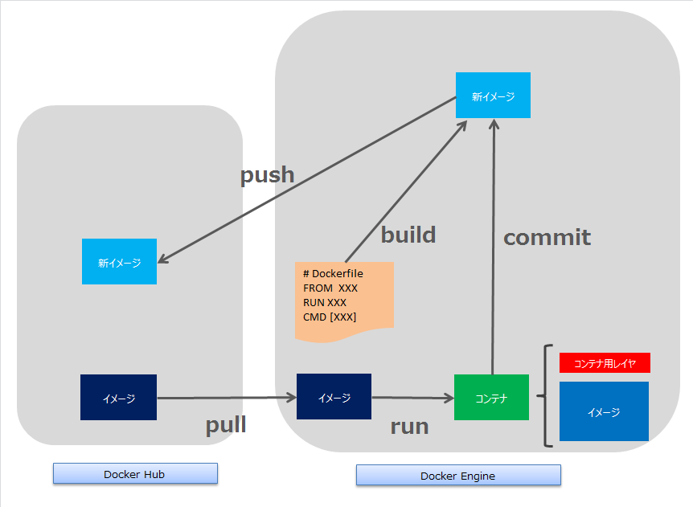
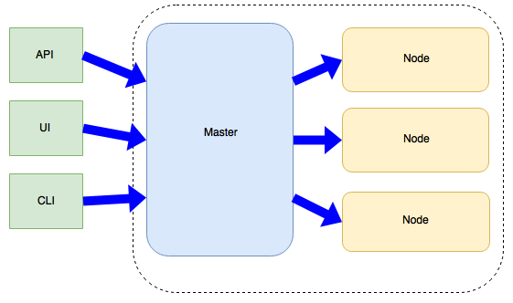
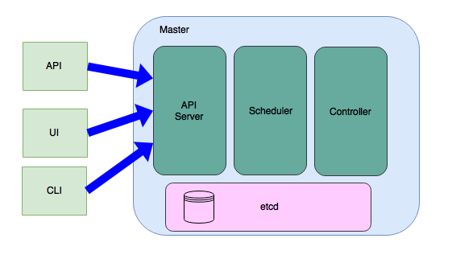
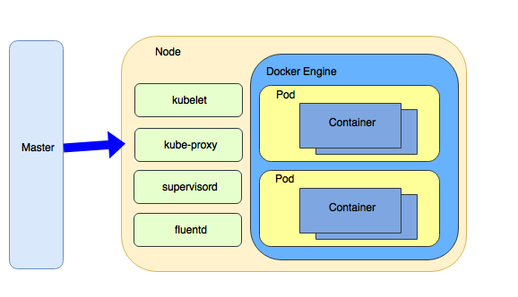
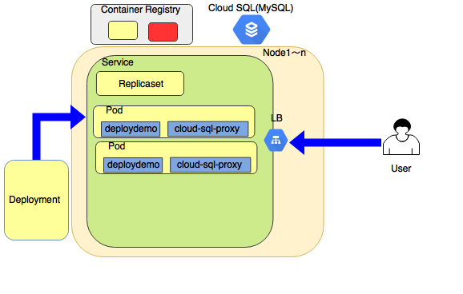
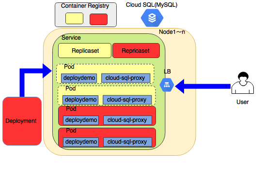

## FITAAT : Docker vs PCF チーム
第２回 今回もDokcerかい..
　  

　  
　  
　  
　　　　FS1 藤田

---

### 今回は、Dockerコンテナをクラウド環境(GKE)にデプロイするまでを試したので、その件について説明

---

### 発表内容
- Dockerのおさらい ！
- GKE？？
- Kubernetesって何 ？？？
- デモ：GKEにてローリングアップデートを試す ！！！！
- PCF..... は、次回

---

### 発表者について
- 最近AWSを使い始めるようになったLv1のクラウド冒険者
- アプリ屋でJava子だが、インフラおぼえたい　
- 最新覚えたDockerを我が物顔で使えて...いる
- BlockChain勉強中、意味不明すぎて困惑している

---

## Dockerのおさらい ！

---

Docker

---

### Dockerの概要 - 1

---

### Dockerの概要 - 2
- Dockerイメージを公式リポジトリから取得
    - MySQLやJenkinsなど、有名なOSS製品はほとんど存在する
- Dockerイメージを実行(RUN)することで、MySQLなどのサービスを内包した環境を利用できる（コンテナとして作成される）
- コンテナで行った変更を新しいのDockerイメージとして保管することができる

---

### Dockerの概要 - 3
- コンテナ起動しなくても、Dockerfileからビルドすることで、オリジナルのDockerイメージを作成することが可能
    - Dockerfileの配布だけで、他マシンで同環境の構築が可能
- docker-composeを利用することで、複数のDockerfileの起動や関連付けが可能となる

---

### コンテナのメリット
- 軽量
    - 仮想マシンと比べて軽量でシンプル
    - 起動が早い
- ポータブル
    - 様々な実行環境に対し、デプロイメントが容易
- 効率性
    - リソース使用量が少ない

---

### 以上！！ 次へ>>

---

## GKEとは ？？

---

### GKEとは
- Google Kubernetes Engine の略
    - Google Container Engine から改名された模様
- クラウドサービス
- Docker コンテナを実行するための強力なクラスタ管理およびオーケストレーション 機能を提供
- Googleが開発し現在オープンソース化されている Kubernetes をベースとしている

---

### コンテナの課題
Dockerはコンテナ単位の管理しかできない
- 複数のノードに対するデプロイは？
- ノード障害、コンテナ障害が発生した場合はどうする？
- アプリケーションのアップグレードは？

---

### ということで、GKE
- Kubernetesはコンテナをクラスタとして管理する仕組み
- DockerとKubernetesをマネージメントしやすくサービス化したのがGKE

---

### GKEの概要
- Kubernetes Engine
    - アプリケーションやサービスを簡単にデプロイ、更新、管理できる
    - 自動スケーリング など
- 0〜5ノードまで無料
    - 6ノード以上は、1ノードあたり$0.15
- 詳しくは[公式サイト](https://cloud.google.com/kubernetes-engine/?hl=ja)を参照

---

### 一旦、以上。次へ>>>  

---

## Kubernetesって何 ？？？

---

Kubernetes

---

### Kubernetes(略して、k8s)とは
- コンテナオーケストレーション
    - 自動デプロイ、スケーリング、アプリ・ コンテナの運用自動化のために設計されたオープンソースのプラットフォーム
    - 2014年にオープンソース化
- Docker 実行環境をクラスタ化する
    - 複数台のホストから構成される実行環境を、あたかも一台の実行環境のように扱う

---

### k8sでやれること
- 複数のコンテナをデプロイ
- コンテナ間のネットワーク管理(名前空間含む）
- コンテナの死活管理
    - コンテナが死んだら自動で起動
- コンテナの負荷分散
    - 同一機能の複数コンテナへのアクセスをバランシング
- コンテナのリソースアロケーション
    - コンテナ毎にCPUやメモリ割り当て

---

### k8s の構成要素

---

### k8s の構成要素
- Master Component
    - クラスタの制御を受けもつ
    - クラスタ内のどのノードでも実行できる
- Node Component
    - 実行中のPodを維持し、k8sランタイム環境を提供する

---

### Master Component イメージ

---

### Master Component イメージ
- API Server
    - 制御部のフロントエンド
    - API ServerをRestAPIで叩くコマンドツールとして kubectlがある
- Shceduler
    - Podのノードへの割り当てを行う

---

### Master Component イメージ
- Controller
    - クラスタの状態を常に監視するバックグラウンドプロセス
    - ReplicaSet、Deployment など
- etcd
    - KVS
    - クラスタの全データを格納するデータストア

---

### Node Component イメージ

---

### Node Component イメージ
- Pod
    - 1〜nのコンテナをデプロイする単位
    - Pod内のコンテナは同じ物理マシン、IPアドレス、などのリソースを共有する
- kubulet
    - プライマリのエージェントで、ノードに割り当てられたPodを監視
- kube-proxy
    - 各Nodeで実行するネットワークプロキシ
    - ネーミングルールに基づき接続や転送を実施
    - iptablesを操作

---

### Node Component イメージ (その他)
- Docker Engine
    - コンテナ実行環境
- supervisord
    - kubelet と Docker Engineのプロセス監視と制御
- fluentd
    - ログ取得のためのプロセス

---

### 以上 ! 次へはデモ >>>

---

## デモ：GKEにてローリングアップデートを試す ！！！！

---

### やること
Cloud SQL Proxy経由でCloud SQLに接続するアプリをデプロイする
- コンテナ クラスタの作成
- DockerImageを作成し、ContainerRegistryに登録
- アカウント、接続情報を設定
- Kubernetes Engineにデプロイする
- 変更したアプリをデプロイする

---

### デプロイメントの補足
- Deployment
    - ローリングアップデートやロールバックといったデプロイ管理の仕組みを提供する
    - ReplicaSetを生成、管理
    - 定義ファイルは、yml もしくは json 形式で記述
- Service
    - アプリケーションのエンドポイント
    - kube-proxy経由でiptablesを操作
- ReplicaSet
    - Podを生成・管理する

---

### 構成

---

### 構成 (ローリングアップデート)

---

### デプロイについて
- デプロイメントを変更した場合、新しいReplicaSetが作成される
- 変更前デプロイ情報は、変更後も一定期間残る。
    - 履歴からロールバックが可能

---

#### まとめ・・

---

### 所感
- 簡単にクラスタ環境構築が可能(お試し程度なら無償でできる)
- 開発側からするとDockerは非常に便利
    - 検証環境がすぐに手に入る
- あまりにも簡単にできたので、細かい仕様が理解できていない
- 運用上の問題が気になるが、整理できてない

---

### 次回
- DevOpsや完全自動化の観点から、メリットデメリットを整理する?
- PCFや類似製品などと比較する?

---

### 参考資料など
- [Google Kubernetes Engine ドキュメント](https://cloud.google.com/kubernetes-engine/docs/?hl=ja)
- [鯨物語～Dockerコンテナとオーケストレーションの理解](https://www.slideshare.net/zembutsu/tale-of-docker)
- [Docker（コンテナ型仮想化）と Kubernetes についての簡単な紹介](https://ubiteku.oinker.me/2017/02/21/docker-and-kubernetes-intro/#what-is-kubernetes)
- [Kubernetes: 構成コンポーネント一覧](https://qiita.com/tkusumi/items/c2a92cd52bfdb9edd613)

---

## おわり

---
