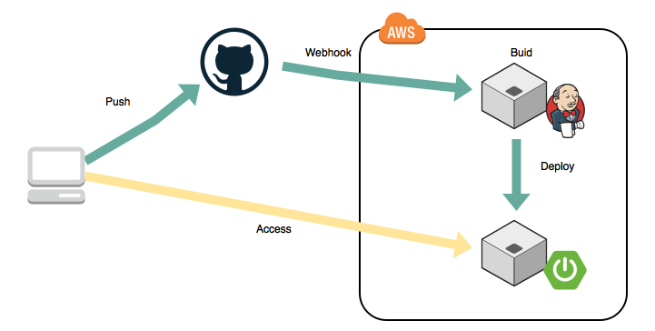

# Jenkinsとは？　基礎編
＠2017-12-01 勉強会

---

### じぇんきんすってなに・・

---

### ということに対する資料！！

---

### 今回の目的
1. Jenkinsが何なのかを知る
2. 簡単なJobの設定方法を知る

---

## その１　Jenkinsが何なのかを知る

---

### Jenkinsとは ?
- JenkinsとはJavaで書かれたオープンソース継続的インテグレーションツールである (引用：[wikipedia Jenkinsより](https://ja.wikipedia.org/wiki/Jenkins))

以上

---

### Jenkinsとは ??
Jenkinsは、ソフトウェアのビルドやcronで起動するジョブなど、**繰り返しのジョブ** の実行を監視する。

このうち、Jenkinsは現在次の2つのジョブに重点を置いている模様。
1. 継続的な、ソフトウェアプロジェクトのビルドとテスト
1. 外部で起動するジョブの実行監視

---

### 継続的なビルドとテスト !
つまり・・
- 容易な継続的インテグレーション(CI)サービスを提供
- 自動化された継続的なビルドは、生産性を向上させる

---

### 継続的なビルドとテスト !!
CIって何？
- continuous integration
- ソフトウエア開発においてコンパイルやテストといったビルド処理を一日に何度も実行することにより、フィードバックサイクルを短くし、品質を向上させる仕組みのこと

---

### 継続的なビルドとテスト !!!
CIを実施することにより・・
- ソフトウエアの修正や変更によってコンパイルが通らなくなる不具合やデグレードなどを早期に発見できる
- 不具合がどの変更によって引き起こされたかを特定しやすくなる

＝＞ 品質向上、手戻りの削減

---

### 継続的なビルドとテスト !!!!
CIにおいて、大事なこと・・
- コンパイルからテスト実行までの流れ（ビルド）をなるべく短い時間で手間をかけずに実行できることが求められる
- テスト実行における自動化の技術が非常に重要

---

### 外部ジョブの実行監視
- 外部ジョブ
    - cron
    - procmail など
- 例として
     - 出力をキャプチャーした定期的なメールを受信し，それを監視する など

---

### Jenkinsの主な特徴

- 簡易なインストール、簡易な設定
    - Warデプロイだけでも良い、WebGUIで設定変更可能
- JUnit/TestNGによるテスト結果のレポート
    - テスト結果の、一覧表示、履歴情報管理、グラフ化
- プラグインサポート
    - サードパーティー性のプラグインで拡張可能

---

### Jenkinsとは!!
1. 継続的インテグレーションサービスを提供する
1. 外部で起動するジョブの実行監視もできる

---

### 以上!! 次へ >>

---
## その２　簡単なJobの設定方法を知る

---

### とりあえずデモ

---

### 実施内容
- ジョブの説明
- リポジトリへのPUSHをトリガーに、ビルドを走らせる
    - Webhook
- 結果の確認

---

### 構成

| 項目 | 内容 |
| --- | --- |
|リポジトリ|GitHub|
|アプリ|SpringBoot|
|ビルドツール|Maven|
|依存解決|Maven|

---

### 構成（環境）

---

### その他
とりあえず、試してみようと思ったら
- お試し/勉強
    - Dockerイメージ
    - EC2に構築
- 社内の場合
    - AXIONのJenkinsサービスを利用する

---

### その他（静的チェックツール紹介）
いずれもide用プラグインあり。
- checksytle
    - コーディング規約
    - 単体テスト時に毎回確認
- findbugs
    - 静的なバグチェック
    - コードレビュー前など（ちょっと重い）

---

おわり

---
