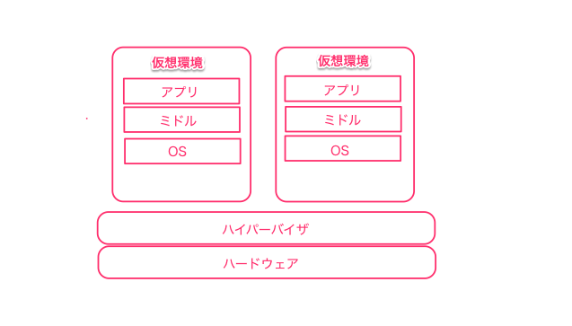
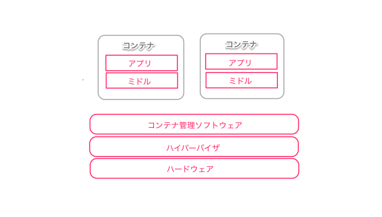

## Docker初心者がとりあえずDockerを使ってみたら・・・

---

### はじめにいっておくことがあります。

---

### すみません!!
### ほとんど出来ておりません！！！

---

### ということで、
### 今回は意気込みだけ！！次回に期待！！

---
### 注意事項

あくまでDocker Lv.1の、よくわからない棒だけ持たされてとりあえず行って来いした人が書いたものです。
そこら辺は、暖かく見守ってください。

---

### それだけ！！
### じゃ、いきます！

---
### 1章 Docker とはなんぞや？
---

すばり、  
コンテナ仮想環境化でアプリケーションを管理/実行するためのオープンソースプラットフォーム

---
ん？コンテナ？　なんですか。。。それ。  
BOXとは違うんですか？？

---
##### ということで、仮想環境について整理。
---

###### まずは、ホスト型仮想環境。

---  
ホストOSに仮想ソフトウェアをインストール。  
仮想ソフトウェア上でゲストOSを動作させる。　

---

代表的なソフトウェア
- Oracle VM VirtulBox
- VMWare Player

---

開発者としては、ローカル環境構築などでよくお世話になる・・よ？  
が、遅い。重い。 低スペック端末だと石化。  

OSの中でほぼそのままのOSを立ち上げている以上、オーバーヘッドが大きい。。  

---

###### 続いて、ハイパーバイザ型仮想環境。

---

ハードウェア上に仮想環境専門のソフトウェア（ハイパーバイザ）を配置。
このハイパーバイザにより仮想環境とハードウェアを制御する。
　　

---

- 代表的なソフトウェア
    - Hyper-v
    - XenSever
        - Amazon EC2 もXenSeverベース

---

オンプレで検証環境を作る場合など。  
自分は構築したことがないので、詳しくはわかりませんが。。

---

###### 残りは、コンテナ型仮想環境

---

ホストOS上に、論理的な区画（コンテナ）を用意し、アプリケーションの動作に必要なライブラリやアプリケーションを格納。ホストOSのリソースを他コンテナと共有することで、あたかも個別のサーバーのように使えるようにしたもの。

---

---

これまでの仮想環境について考えてみる

### 3枚目のスライド

---

### おわり
