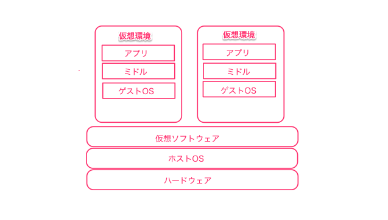

## Docker初心者がとりあえずDockerを使ってみたら・・・

---

### はじめにいっておくことがあります。

---

### すみません!!
### ほとんど出来ておりません！！！

---

### ということで、
### 今回は意気込みだけ！！次回に期待！！

---
### 注意事項

あくまでDocker Lv.1の、よくわからない棒だけ持たされてとりあえず行って来いした人が書いたものです。
そこら辺は、暖かく見守ってください。

---

### それだけ！！
### じゃ、いきます！

---
### 1章 Docker とはなんぞや？
---

すばり、  
コンテナ仮想環境化でアプリケーションを管理/実行するためのオープンソースプラットフォーム

---
ん？コンテナ？　なんですか。。。それ。  
BOXとは違うんですか？？

---
##### ということで、仮想環境について整理。
---

###### まずは、ホスト型仮想環境。

---  
ホストOSに仮想ソフトウェアをインストール。  
仮想ソフトウェア上でゲストOSを動作させる。　

---

開発者としては、少なくともローカルの検証環境など使用しているはず。  
が、遅い。重い。 低スペック端末だと石化。  

OSの中でほぼそのままのOSを立ち上げている以上、オーバーヘッドが大きい。。  

---

代表的なソフトウェア
- Oracle VM VirtualBox
- VMWare Player
- Virtual PC

---

###### 続いて、ハイパーバイザ型仮想環境。

---

ハードウェア上に仮想環境専門のソフトウェア（ハイパーバイザ）を配置。
このハイパーバイザにより仮想環境とハードウェアを制御するため、ほぼマシン全体が仮想環境というイメージ。
　　

---

ハイパーバイザ型は、だいたいファームウェアで提供されている。  
自分のわかる範囲では、オンプレで開発環境や検証環境を構築する場合など利用している。    
また、起動時のオーバーヘッドが大きいと聞く。
実際に構築したことがないので、詳しくはわかりませんが。。  

---

- 代表的なソフトウェア
    - Hyper-v
    - XenSever
        - Amazon EC2 もXenSeverベース

---

###### 残りは、コンテナ型仮想環境

---

ホストOS上に、論理的な区画（コンテナ）を用意し、アプリケーションの動作に必要なライブラリやアプリケーションを格納してホストOSから分離。ホストOSのリソースを他コンテナと共有することで、あたかも個別のサーバーのように使うことができる。

---
Dockerは、これです。
ようするに、軽量な仮想環境ってことですか! （汗）

---

なるほど！　ということで・・

---

### 第2章 よくわからないから、Dockerを導入してみる

---

##### やりたいこと
- ローカル環境(Mac)にDockerをインストール！
- DB ServerをDokcerコンテナに置き換える！！

---

##### まずはインストール。

---

###### 当初のイメージ
DockerのホストOSってLinux上で動くからVMに専用のOS立てて、そこにインストールするか。。

---

###### 開始０.１秒で気づいたこと
Mac版(Docker for Mac)が存在する！！さらに、Windows版もある？  
- xhybe(ネイティブHypervisor.Frameworkを軽量化したハイパーバイザ)を利用するため、Virtual Box不要
- Macであれば、もちろんhomebrewで導入可能

---

brew-caskで導入  

    $ brew cask install docker   # /Applications/Docker.app作成  

以上！  
あとは、Docker.appを起動すればOK。

---

##### で、次は何をする？
そもそも、Dockerコンテナってどうやって作成する？

---

Dockerコンテナ作成  
1. 元となるimageをDockerHub(※1)よりダウンロードする
1. 取得したimageから、コンテナを作成する諸設定を適用した新たなimageを作成する
1. もしくは、そのコンテナを変更して、新たなimageを作成してからコンテナを作成する

※1: Docker公式のリポジトリサービス

---

##### imageをダウンロードする。

---

- まずは、Docker HubのWebサイトにて、アカウント作成を行う。
- 次に、CLIにて、Docker Hubにログインする。

      $ docker login  
      Username: 登録したユーザ名
      Password: 登録したパスワード
      Email: 登録したEmail
      Login Succeeded

---

- imageを検索する。

      $ docker search mysql  # イメージ名を指定
      NAME 　DESCRIPTION 　STARS 　OFFICIAL 　AUTOMATED
      mysql  ・・・　　　　　・・・　 [OK]       ・・・

- imageをダウンロードする。

      $ docker pull mysql:5.7  # イメージ名:タグ名　最新タグはlastest

---

##### imageからコンテナを作成/変更し、  
##### 新しいimageを作成する

---

- imageよりコンテナを作成＆起動する

      $ docker run -e MYSQL_ROOT_PASSWORD=root -d --name mysqld mysql  # コンテナ作成＆起動  -dはバックグラウンド起動

- 変更後のコンテナを保存し、新しいイメージを作成する
      $ docker exec -it mysqld /bin/bash  # 稼働中のコンテナにアクセス
      # なんらかの設定を加えて、抜ける
      ・・・・
      $ docker commit mysqld mysql:new  #  mysqlの新しいタグを発行

---

##### とりあえず、コンテナ作成は出来たが・・・  
##### コンテナ起動時に、DDL投入やデータ投入を行いたい！
##### あとはスクリプトで行いたい（Infrastructure-as-code）

---

Dockerでは、image取得から諸設定後のimage作成を自動化する場合、Dockerfileに記載する。
- ファイル名は 「Dockerfile」
    - 別の名前も指定可能だが、その場合、DockerHubのイメージ自動生成機能が使えないらしい

---
とりあえず、こんな風に・・

---

mysqlのコンテナの場合、環境変数に値を設定すると  
データベースやユーザを自動作成してくれるらしい。
- MYSQL_DATABASE : 作成するデータベース名
- MYSQL_USER ： 作成するユーザ
- MYSQL_PASSWARD：作成するユーザのパスワード

※ 自分の環境では、ユーザ追加はされませんでした・・  

---

ちなみに、mysqlなどのイメージのDockerfileは、githubにて公開されている。  
[docker-library/mysql](https://github.com/docker-library/mysql/blob/0590e4efd2b31ec794383f084d419dea9bc752c4/5.7/Dockerfile)

---

また、複数のコンテナ（Dockerfile）を管理する場合は、docker-composeを使用する。  
今後コンテナを増やす予定なので、docker-composeを使用する。

---

docker-compose.ymlに記載。

---

あとは、docker-composeコマンドにて、image作成およびコンテナ起動する！ (ymlファイルのディレクトにて実行)

    $ docker-compose build  # image作成
    $ docker-compose up -d  # コンテナ起動

---
とりあえず起動した・・ようだ！

---
Repositoryクラスのテストも無事成功!!

---

ここで終了・・・・・

---

#### 今後やりたいこと

- マイクロサービスアーキテクチャ（風）のアプリに改造する
    - とりあえずSpringCloudベース
- ローカルにKubernetes(minikube)を導入し、アプリをデプロイしてみる
- それをクラウド上(GKE)にもデプロイしてみる
- PCFにもデプロイしてみる（できるか？）

---

### おわり
